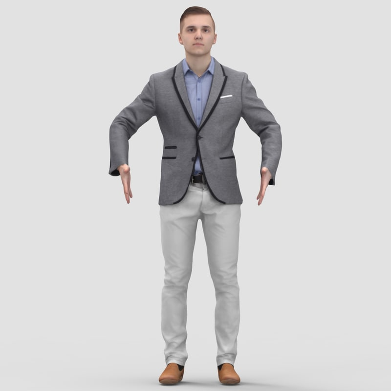

# Human-Pose-Estimation-opencv
Perform Human Pose Estimation in OpenCV Using OpenPose MobileNet
<br>
<br>
<br>

<br>
<br>


# How to use

- Test with webcam

```
python openpose.py
```

- Test with image
```
python openpose.py --input image.jpg
```
